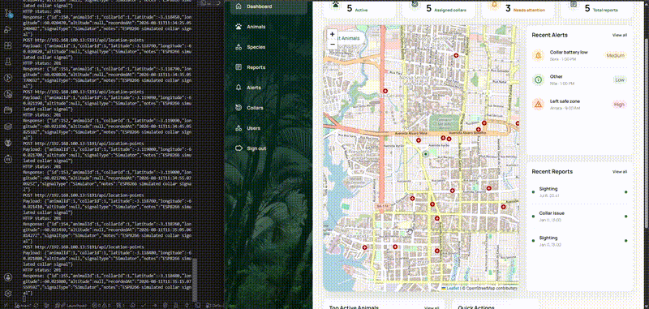

# Wildlife Conservation Platform

Wildlife Conservation Platform is a full-stack technical prototype for tracking GPS-collared wildlife, recording ranger observations, and monitoring operational alerts. It combines a .NET 8 Web API, PostgreSQL, and an Angular 16 dashboard with a Leaflet map.

An ESP8266 NodeMCU collar simulator sends GPS-like movement data to the API. Each accepted location is persisted before the backend publishes a SignalR event, allowing the Angular map to move the corresponding animal marker in real time without a page refresh.

## Demo



Full demo video: [Watch on YouTube](https://www.youtube.com/watch?v=e9sCaPA0A-w&feature=youtu.be)

The demo shows an ESP8266 collar simulator sending GPS-like location points to the backend. Each point is saved and broadcast through SignalR before the backend returns HTTP `201 Created`, so the Angular Leaflet map updates in real time without a refresh.

The animated preview and screenshots are available in [`media/`](media/).

- [Dashboard screenshot](media/screenshots/dashboard.png)
- [Live marker details](media/screenshots/marker_details.png)
- [Serial monitor and map](media/screenshots/serial_monitor_map.png)

## Live Tracking Flow

ESP8266 collar simulator
→ HTTP POST /api/location-points
→ .NET 8 Web API
→ PostgreSQL
→ SignalR LocationPointReceived event
→ Angular + Leaflet map update


## Key Features

- Wildlife tracking dashboard with an interactive Leaflet map
- Latest known location for each tracked animal
- Real-time marker updates through SignalR
- ESP8266 NodeMCU collar simulator built with PlatformIO
- GPS-like movement simulation along a predefined route
- Animal, species, subspecies, collar, and collar-assignment management
- Ranger reports and operational alerts
- JWT authentication and permission-based RBAC authorization
- Many-to-many user-role and role-permission assignments
- Seeded demo users and domain data for local testing
- Swagger/OpenAPI documentation
- xUnit backend test project

## Tech Stack

### Backend

- .NET 8 Web API
- Entity Framework Core
- PostgreSQL
- AutoMapper
- SignalR
- JWT bearer authentication
- Swagger/OpenAPI
- xUnit

### Frontend

- Angular 16 with NgModules
- Reactive Forms
- Angular Router with authentication and permission guards
- Leaflet
- Microsoft SignalR client
- Development API proxy configuration

### Hardware Prototype

- ESP8266 NodeMCU
- PlatformIO
- Arduino framework
- HTTP POST signal simulation

## Repository Structure

backend/                    .NET solution, API, domain layers, and tests
frontend/                   Angular dashboard
hardware/esp8266-collar/    PlatformIO collar simulator
media/                      Animated preview and screenshots


## MVP Domain

- Species
- Subspecies
- Animals
- Collars
- Collar assignment history
- Location points
- Ranger reports
- Alerts
- Users
- Roles
- Permissions

## Authentication And Authorization

The platform uses JWT bearer authentication and persisted role-based access control. Users and roles have a many-to-many relationship through `UserRoles`; roles and permissions have a many-to-many relationship through `RolePermissions`. Permission codes are represented by the strongly typed `PermissionCode` enum, while role assignments and permission grants are stored in PostgreSQL.

Backend policies and frontend guards check effective permissions rather than role names. The seeded roles are `Admin`, `Ranger`, `Researcher`, and `Master`; a seeded account for each role is included for local testing, with their development-only credentials defined in `UserConfiguration`.

The SignalR hub requires a valid JWT. For prototype simulation, `POST /api/location-points` also accepts an `X-Device-Key` header. This represents device-level collar authentication without requiring the ESP8266 simulator to obtain and refresh a user JWT. The location-point read endpoints continue to require an authenticated application user.

### Permission Matrix

| Role | Access |
| --- | --- |
| Master | Unrestricted access to protected application endpoints. Can manage all users, including Admin and Master users. |
| Admin | Full conservation-domain access. Can manage Ranger and Researcher users and their own account, but cannot modify other Admin or Master users or assign the Master role. |
| Ranger | Can manage animals, collars, collar assignments, alerts, ranger reports, species, and subspecies. Location-point ingestion is device-key protected. Cannot manage users or roles. |
| Researcher | Read-only access to conservation data. Has no application write permissions. |

Authorization is enforced on the backend; frontend guards only control navigation and visibility. A device key is a separate authentication mechanism and is not equivalent to a user role.

## Backend Solution Structure

- `WildlifeConservation.Api`
  - Controllers, response DTOs, response mapping profiles, middleware, Swagger, JWT authentication setup, authorization policies, and SignalR hub configuration.
  - Response DTOs are grouped by feature, for example `DTOs/Animals/AnimalResponseDto.cs` and `DTOs/Animals/AnimalResponseProfile.cs`.

- `WildlifeConservation.DTOs`
  - Incoming request DTOs only.
  - DTOs are records, for example `UpsertAnimalDto` and `ResolveAlertDto`.

- `WildlifeConservation.Models`
  - Domain entities grouped by feature.
  - Each entity folder contains the entity, EF Core configuration, and incoming DTO-to-entity AutoMapper profile.

- `WildlifeConservation.Repositories`
  - `WildlifeDbContext`, migrations, entity repositories, and `BaseRepository<TEntity>`.
  - There is no `IBaseRepository`.
  - Each repository interface is declared in the same file as its concrete repository.
  - `BaseRepository<TEntity>` owns shared persistence logic, including no-tracking queries and shallow insert/update/delete operations.

- `WildlifeConservation.Services`
  - Service interfaces and implementations.
  - Services accept incoming DTO records where needed, but return domain models/entities.
  - Controllers map service results to API response DTOs.

- `WildlifeConservation.Shared`
  - Shared enums, password hashing, and common exceptions.

- `WildlifeConservation.Tests`
  - xUnit backend test project.

## Architecture Rules

- Controllers expose API DTOs.
- Services do not return response DTOs.
- Incoming DTOs live in `WildlifeConservation.DTOs`.
- Outgoing response DTOs live in `WildlifeConservation.Api`.
- Repository queries are no-tracking by default.
- Updates use shallow scalar-property updates in `BaseRepository<TEntity>` instead of `DbSet.Update(entity)`.
- EF configurations live beside their entities in the Models project.
- AutoMapper profiles live beside the DTO/entity boundary where they are used.
- New location points are saved before SignalR broadcasts are sent.
- Services must not broadcast a location update until the database save succeeds.

## Testing

Run the backend tests from `backend/`:

```powershell
dotnet test WildlifeConservationPlatform.sln
```

The current test suite covers permission authorization, role seed configuration, service registration, and user validation. PostgreSQL-backed integration coverage for transactional deletes, device authentication, and end-to-end authorization is a planned next step.

Build the frontend from `frontend/`:

```powershell
npm ci
npm run build
```

## Data Retention And Deletes

For the MVP, delete operations physically remove dependent demo data inside a database transaction to keep referential integrity consistent. In a production version, most destructive deletes should be replaced with soft-delete or archive states, especially for animals, collars, location history, ranger reports, alerts, and users, because conservation systems need historical traceability.


## Production Roadmap

- Replace destructive deletes with archive/soft-delete workflows and immutable audit records.
- Add PostgreSQL integration tests and transactional-delete scenarios.
- Add device registration, per-device credentials, key rotation, rate limiting, and replay protection.
- Add health checks, structured redacted logging, metrics, and request correlation IDs.
- Add CI/CD, Docker Compose development setup, and production deployment documentation.
- Add spatial indexing and richer geospatial queries as tracking data volume grows.

## Run Locally

Prerequisites are .NET 8, Node.js/npm, and PostgreSQL.

### Backend

Run backend commands from the repository root:

```powershell
cd backend
```


Configure local settings through .NET user-secrets or environment variables. Do not commit real database passwords, JWT keys, or device keys. The following values are local examples only:

```powershell
cd WildlifeConservation.Api
dotnet user-secrets set 'Jwt:Key' 'replace-with-a-long-random-development-secret'
dotnet user-secrets set 'DeviceApiKey' 'replace-with-a-separate-random-device-key'
cd ..
```


Apply migrations:

```powershell
dotnet ef database update --project WildlifeConservation.Repositories\WildlifeConservation.Repositories.csproj --startup-project WildlifeConservation.Api\WildlifeConservation.Api.csproj
```


Start the API:

```powershell
dotnet run --project WildlifeConservation.Api\WildlifeConservation.Api.csproj
```


Swagger:

```text
http://localhost:5191/swagger
https://localhost:7246/swagger
```


In the Development environment, the API also applies pending migrations at startup.

### Frontend

Start Angular from a second terminal:

```powershell
cd frontend
npm install
npm start
```


The frontend runs at `http://localhost:4200`. Its development environment connects to the API and authenticated SignalR hub at `http://localhost:5191`; `proxy.conf.json` is also available for proxied `/api` requests.

## ESP8266 Collar Simulator

The PlatformIO project in [`hardware/esp8266-collar/`](hardware/esp8266-collar/) sends a point from a predefined GPS-like route every ten seconds to `POST /api/location-points`.

The simulator omits `recordedAt`, so the API supplies the server-side UTC default and normalizes it before persistence. After the location is saved, the backend broadcasts `LocationPointReceived`, and the Angular dashboard moves the animal marker in place.

Wi-Fi credentials and the device key belong in the ignored `include/secrets.h` file, created from `include/secrets.example.h`. The API URL must use the development machine's LAN address rather than `localhost`. See the [collar setup guide](hardware/esp8266-collar/README.md) for configuration, upload, serial monitoring, LAN binding, and optional ESP32 support.

## Build And Test

Backend:

```powershell
cd backend
dotnet build WildlifeConservationPlatform.sln
dotnet test WildlifeConservationPlatform.sln
```


Frontend:

```powershell
cd frontend
npm run build
```


## Main Endpoints

- `POST /api/auth/login`
- `GET /api/auth/current-user`
- `GET /api/species`
- `GET /api/species/{id}`
- `POST /api/species`
- `PUT /api/species/{id}`
- `DELETE /api/species/{id}`
- `GET /api/subspecies`
- `GET /api/subspecies/{id}`
- `POST /api/subspecies`
- `PUT /api/subspecies/{id}`
- `DELETE /api/subspecies/{id}`
- `GET /api/animals`
- `GET /api/animals/{id}`
- `POST /api/animals`
- `PUT /api/animals/{id}`
- `DELETE /api/animals/{id}`
- `GET /api/collars`
- `GET /api/collars/{id}`
- `POST /api/collars`
- `PUT /api/collars/{id}`
- `DELETE /api/collars/{id}`
- `POST /api/collar-assignments`
- `PUT /api/collar-assignments/{id}/unassign`
- `POST /api/location-points`
- `GET /api/location-points/latest`
- `GET /api/location-points/by-animal/{animalId}`
- `GET /api/ranger-reports`
- `GET /api/ranger-reports/{id}`
- `POST /api/ranger-reports`
- `GET /api/ranger-reports/by-animal/{animalId}`
- `GET /api/alerts`
- `GET /api/alerts/{id}`
- `POST /api/alerts`
- `PUT /api/alerts/{id}/resolve`
- `GET /api/users`
- `POST /api/users`
- `PUT /api/users/{id}`
- `PUT /api/users/{id}/assigned-area`
- `DELETE /api/users/{id}`

## Current Status

Phase 1 technical prototype is complete:

- Backend domain model and REST API implemented
- Angular frontend implemented
- Leaflet map integrated
- SignalR live location updates working
- JWT authentication and role-based access added
- ESP8266 simulated collar signal flow working end to end
- Demo video, animated preview, and screenshots captured

## Future Improvements

- Replace simulated movement with readings from a real GPS module
- Build an offline-first ranger mobile app
- Add LoRa or satellite connectivity for remote areas
- Add patrol areas and geofencing
- Generate automatic alerts for missing signals or abnormal movement
- Add richer movement-history visualization
- Improve UI responsiveness and accessibility
- Add production deployment configuration
